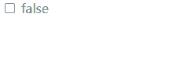
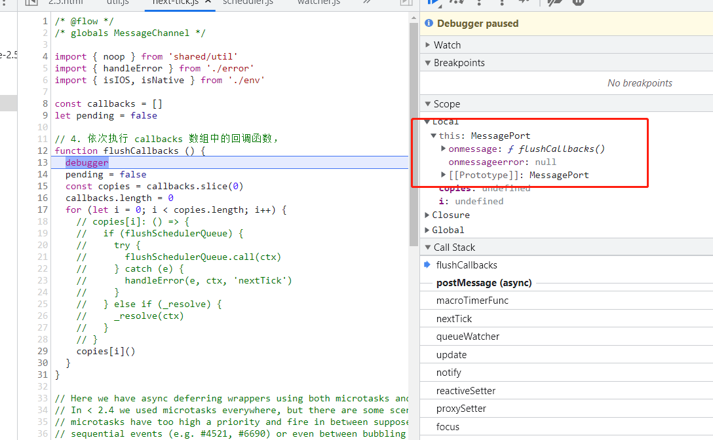
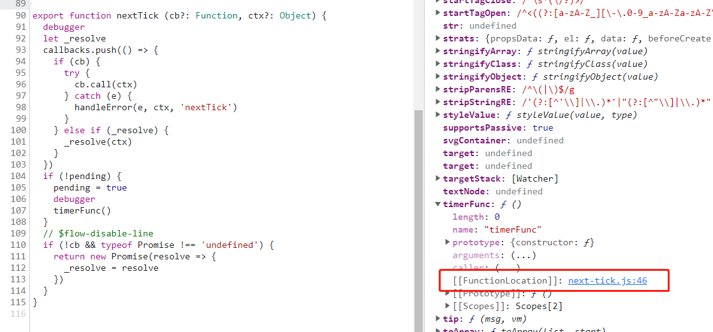
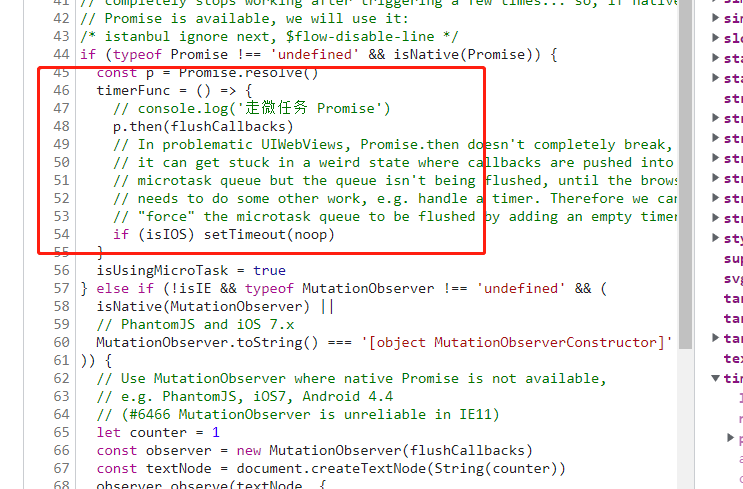

# 探究 nextTick 在 vue 不同版本下的差异

## 问题

首先来看下面这一段代码，它的操作很简单：

页面渲染了一个复选框，当点击复选框框时阻止 click 事件的默认行为，并在 click 的回调的中对复选框的 checked 值取反，从而改变复选框的 checked 状态。

```html
<!DOCTYPE html>
<html>
<head>
  <meta charset="UTF-8">
  <!-- import CSS -->
  <link rel="stylesheet" href="https://unpkg.com/element-ui/lib/theme-chalk/index.css">
</head>
<body>
  <div id="app">
    <input
      type="checkbox"
      :checked="checked"
      @click.prevent="handleClick"> {{ checked }}
  </div>
</body>
  <!-- import Vue before Element -->
  <script src="https://cdn.jsdelivr.net/npm/vue@2.5.17/dist/vue.js"></script>
  <!-- import JavaScript -->
  <script src="https://unpkg.com/element-ui/lib/index.js"></script>
  <script>
    new Vue({
      el: '#app',
      data: function() {
        return {
          checked: false
        };
      },
      methods: {
        handleClick () {
          this.checked = !this.checked
        }
      }
    })
  </script>
</html>
```

但是同样的操作在 `vue@2.5.17` 版本与 `vue@2.6.14` 版本下表现并不一致：

**2.5版本：**



**2.6版本：**


可以看到，2.5 版本下复选框的勾选状态与 checked 的值是同步的；但在 2.6 版本下，checked 值虽然改变了，复选框的选中状态并没有发生变化；

## 过程分析

那么又是什么原因导致的同一段代码在两个版本的 vue 下表现不一致呢？

这里通过 debugger 的方法，来观察 change 回调触发 `this.checked = !this.checked` 后 vue 是如何运转的：

## 2.5 版本 nextTick

1. 首先是复选框勾选状态被改变，回调被触发，checked 的值被改变：

   ```javascript
   methods: {
       handleClick () {
           this.checked = !this.checked
       }
   }
   ```

2. 由于数据被改变，vue 会对相关依赖进行派发更新，那么会命中 Watcher 实例上的 update() 方法，这个方法可以简单理解为：当 watcher 依赖的数据源发生改变时，就会执行这个方法，做一些组件重新渲染前的准备工作；

   ```javascript
   // src/core/observer/watcher.js
   export default class Watcher {
     // ......（省略）
     update () {
       if (this.lazy) {
         this.dirty = true
       } else if (this.sync) {
         this.run()
       } else {
         debugger
         // 在这里又调用了 queueWatcher 这一方法
         queueWatcher(this)
       }
     }
     // ......（省略）
   }
   
   ```

   而在 update() 中又调用了 queueWatcher 这一方法，下面来看一下 queueWatcher 的实现：

3. queueWatcher 这个函数使用了一个 queue 即先进先出的队列，并将我们刚刚传入的 watcher 实例 push 进队列，最后在 nextTick 的时候，执行 flushSchedulerQueue 函数；

   ```javascript
   // src/core/observer/scheduler.js
   export function queueWatcher (watcher: Watcher) {
     debugger
     const id = watcher.id
     if (has[id] == null) {
       has[id] = true
       if (!flushing) {
         queue.push(watcher)
       } else {
         let i = queue.length - 1
         while (i > index && queue[i].id > watcher.id) {
           i--
         }
         queue.splice(i + 1, 0, watcher)
       }
       // queue the flush
       if (!waiting) {
         waiting = true
         // 在 nextTick 的时候，执行 flushSchedulerQueue 函数
         // 我们接着看一下 flushSchedulerQueue 和 nextTick 的实现
         nextTick(flushSchedulerQueue)
       }
     }
   }
   ```

   flushSchedulerQueue 这个函数主要做的就是循环 queue 这个队列，并依次调用我们推入队列里的 watcher 实例上的 run() 方法，去重新渲染组件：

   ```javascript
   // src/core/observer/scheduler.js
   
   function flushSchedulerQueue () {
     flushing = true
     let watcher, id
     queue.sort((a, b) => a.id - b.id)
     for (index = 0; index < queue.length; index++) {
       watcher = queue[index]
       id = watcher.id
       has[id] = null
       debugger
       // 循环 queue，依次调用 queue 里的 watcher 实例上的 run() 方法
       watcher.run()
     }
     // ......（省略）
   }
   ```

4. 那么 nextTick  函数又在这里起到了什么作用呢？

   实际上 vue 并不会立即去执行 flushSchedulerQueue 函数从而重新渲染组件，而是在 nextTick 方法中将刚刚传入的 flushSchedulerQueue 以回调函数的形式推入 callbacks 数组；

   ```javascript
   // src/core/util/next-tick.js
   
   // nextTick 将刚刚传入的 flushSchedulerQueue 作为回调函数，放入 callbacks 数组中
   // 并在下一个 tick 依次执行 flushSchedulerQueue 函数；
   // 我们刚刚说到 flushSchedulerQueue 函数的主要作用就是调用 watcher 实例上的 run() 方法，去重新渲染组件
   // 由此可证，vue 组件的重新渲染是在下一个 tick 执行的
   export function nextTick (cb?: Function, ctx?: Object) {
     debugger
     let _resolve
     // 将刚刚传入的 flushSchedulerQueue 作为回调函数，放入 callbacks 数组中
     callbacks.push(() => {
       if (cb) {
         try {
           cb.call(ctx)
         } catch (e) {
           handleError(e, ctx, 'nextTick')
         }
       } else if (_resolve) {
         _resolve(ctx)
       }
     })
     // ......（省略）
   }
   ```

   那么 callbacks 里的函数又是什么时候被调用的呢？我们接着往下看：

   下面的代码会去判断是使用宏任务还是微任务，如果是宏任务调用 **macroTimerFunc** 方法，否则调用 **microTimerFunc** 方法；

   这两个方法做的就是：**以微任务 / 宏任务的形式在下一个 tick 执行 callbacks 数组里的回调函数，也就是执行 flushSchedulerQueue；**

   我们前面说到 flushSchedulerQueue 函数的主要作用就是调用 watcher 实例上的 run() 方法，去重新渲染组件；由此可知，vue 组件的重新渲染也是在下一个 tick 执行的：

   ```javascript
   // src/core/util/next-tick.js
   
   export function nextTick (cb?: Function, ctx?: Object) {
     // ......（省略）
     if (!pending) {
       pending = true
       // 判断是使用宏任务还是微任务
       if (useMacroTask) {
         // 2.5.17版本下，会命中这里的逻辑
         // macroTimerFunc 是使用 MessageChannel 实现的宏任务
         // macroTimerFunc/microTimerFunc 这两个函数被调用
         // 就会去执行 callbacks 数组里的回调函数，也就是执行 flushSchedulerQueue
         // flushSchedulerQueue 被执行，最终就会调用 watcher 上的 run() 方法，重新渲染组件
         macroTimerFunc()
       } else {
         microTimerFunc()
       }
     }
     // ......（省略）
   }
   ```

   接下来我们来具体看一下 **macroTimerFunc** 方法和 **microTimerFunc** 方法的实现：

   macroTimerFunc 的实现会先判断当前环境是否支持 setImmediate，如果不支持再去检测是否支持 MessageChannel，如果还不支持最后就会降级为 setTimeout；

   而 microTimerFunc 的实现，则会先判断当前环境是否支持  Promise，如果不支持的话直接使用 macroTimerFunc；

   ```javascript
   // src/core/util/next-tick.js
   
   let microTimerFunc
   let macroTimerFunc
   let useMacroTask = false
   
   // macroTimerFunc 先判断当前环境是否支持 setImmediate
   if (typeof setImmediate !== 'undefined' && isNative(setImmediate)) {
     macroTimerFunc = () => {
       setImmediate(flushCallbacks)
     }
   } else if (typeof MessageChannel !== 'undefined' && (
     isNative(MessageChannel) ||
     // PhantomJS
     MessageChannel.toString() === '[object MessageChannelConstructor]'
   )) {
     // macroTimerFunc 如果不支持 setImmediate 再检测是否支持 MessageChannel
     const channel = new MessageChannel()
     const port = channel.port2
     channel.port1.onmessage = flushCallbacks
     macroTimerFunc = () => {
       port.postMessage(1)
     }
   } else {
     // 如果 setImmediate 和 MessageChannel 都不支持最后就会降级为 setTimeout；
     macroTimerFunc = () => {
       setTimeout(flushCallbacks, 0)
     }
   }
   // microTimerFunc 判断是否支持  Promise
   if (typeof Promise !== 'undefined' && isNative(Promise)) {
     const p = Promise.resolve()
     microTimerFunc = () => {
       p.then(flushCallbacks)
       if (isIOS) setTimeout(noop)
     }
   } else {
     // 不支持的话直接使用 macroTimerFunc
     microTimerFunc = macroTimerFunc
   }
   ```

   在 macroTimerFunc / microTimerFunc 方法中，又调用了 flushCallbacks 这一方法，**我们之前 push 进 callback 的函数就是在这里被调用**；

5. **此外 next-tick 文件中还暴露了一个 withMacroTask 方法，这个方法是用来给 `v-on` 之类的 DOM 操作事件做一层包装，确保回调命中的是宏任务的逻辑：**

   ```javascript
   // src/core/util/next-tick.js
   
   export function withMacroTask (fn: Function): Function {
     return fn._withTask || (fn._withTask = function () {
       useMacroTask = true
       const res = fn.apply(null, arguments)
       useMacroTask = false
       return res
     })
   }
   ```

   因此对于我们的 change 回调，会强制走 macroTimerFunc 的逻辑，在 chrome 它是一个通过 `MessageChannel` 实现的宏任务；

   从下图调试工具截图中也可以看到 **flushCallbacks 函数被调用时，this 指向了 MessagePort**：

   


## 2.6 版本 nextTick

对于 2.6 版本的 vue，前面的派发更新逻辑与 2.5 版本 vue 基本一致，但在对 nextTick 的实现上有一些差别，我们来看一下 2.6 版本的 nextTick：

```javascript
let timerFunc

if (typeof Promise !== 'undefined' && isNative(Promise)) {
  const p = Promise.resolve()
  timerFunc = () => {
    p.then(flushCallbacks)
    if (isIOS) setTimeout(noop)
  }
  isUsingMicroTask = true
} else if (!isIE && typeof MutationObserver !== 'undefined' && (
  isNative(MutationObserver) ||
  // PhantomJS and iOS 7.x
  MutationObserver.toString() === '[object MutationObserverConstructor]'
)) {
  let counter = 1
  const observer = new MutationObserver(flushCallbacks)
  const textNode = document.createTextNode(String(counter))
  observer.observe(textNode, {
    characterData: true
  })
  timerFunc = () => {
    counter = (counter + 1) % 2
    textNode.data = String(counter)
  }
  isUsingMicroTask = true
} else if (typeof setImmediate !== 'undefined' && isNative(setImmediate)) {
  timerFunc = () => {
    setImmediate(flushCallbacks)
  }
} else {
  // Fallback to setTimeout.
  timerFunc = () => {
    setTimeout(flushCallbacks, 0)
  }
}
```

可以看到，代码中 **withMacroTask** 的逻辑被剔除了，而 timerFunc 的降级顺序依次为：

 Promise（微任务） => MutationObserver（微任务） => setImmediate（宏任务）=> setTimeout （宏任务）

也就是说，对于 `v-on` 绑定的回调，2.6 版本是用 Promise 微任务来实现的；

在调试工具中也可以看到，timerFunc 的实现指向了 46 行，也就是通过 Promise 来实现。






现在我们知道了在 2.5 版本和 2.6 版本下最主要差异，就在于 2.5 版本 `v-on` 回调使用宏任务，而 2.6 版本的 `v-on` 回调使用微任务。

那么这个差异又是如何影响组件渲染的呢？

我简单分析了一下复选框被勾选后的一个大致流程：

**在 2.5 版本下：**

1. 复选框被点击勾选，click 事件被触发 prevent 阻止默认事件的修饰符生效，阻止复选框被勾选的行为重新渲染 DOM；由于 DOM 渲染是宏任务，此次 DOM 重新渲染被放入下一个 tick 执行；
2. handleClick 回调事件被触发，`this.checked = !this.checked` ，由于 checked 默认值为 false，此时被设置为 true，组件准备重新渲染，**此次重新渲染同样作为宏任务**，在下一个 tick 执行；
3. 当前任务栈任务执行完毕，检查是否有微任务；
4. 由于当前没有微任务，于是先执行了步骤 1 中的 DOM 渲染，复选框选中状态被取消；
5. 步骤 4 中 DOM 重新渲染完毕，继续执行步骤 2 中的宏任务；此时的 checked 值为 true，因此重新渲染后的复选框又被勾选上了。


**在 2.6 版本下：**

1. 复选框被点击勾选，click 事件被触发 prevent 阻止默认事件的修饰符生效，阻止复选框被勾选的行为重新渲染 DOM；由于 DOM 渲染是宏任务，此次 DOM 重新渲染被放入下一个 tick 执行；
2. handleClick 回调事件被触发，`this.checked = !this.checked` ，由于 checked 默认值为 false，此时被设置为 true，组件准备重新渲染，**此次重新渲染作为微任务**，放在下一个 tick 执行；
3. 当前任务栈任务执行完毕，检查是否有微任务；
4. 命中步骤 2 中的微任务，也就是将复选框的值勾选上，但由于此时的复选框就是选中的状态，所以并不会触发 DOM 的重新渲染；
5. 微任务执行完毕，检查是否有宏任务，此时就会命中步骤 1 中的宏任务，也就是执行 DOM 渲染，而步骤 1 中的我们阻止了默认事件，因此再次渲染后、复选框的选中状态又会被取消。


至此，我们就知道了 nextTick 对组件渲染结果的影响。