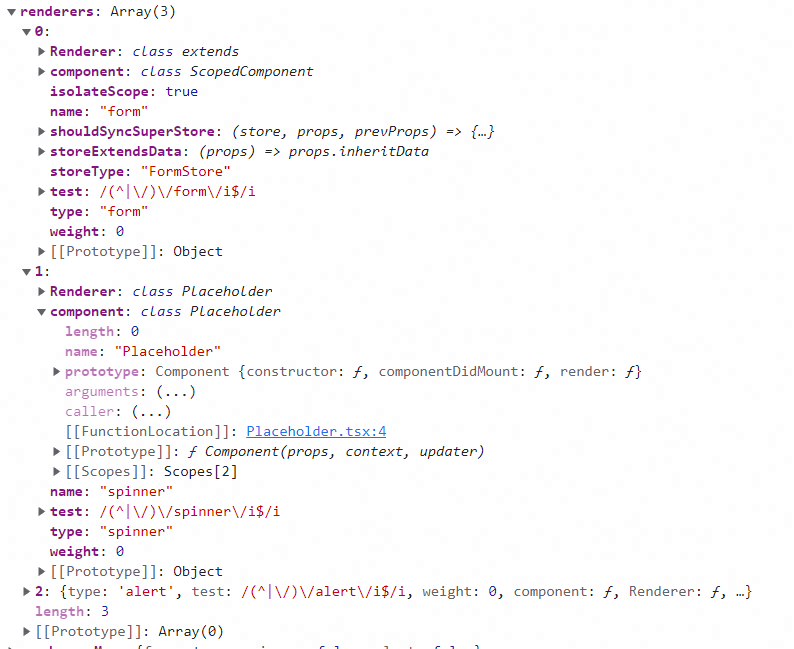

# amis源码学习

## 组件注册原理

### 1.定义组件

使用 react 定义一个类式组件：如 spinner

```javascript
// packages\amis\src\renderers\Spinner.tsx
export class SpinnerRenderer extends React.Component<SpinnerRenderProps> {
  renderBody() {
    const {body, render} = this.props;
    return body ? render('body', body) : null;
  }
  render() {
    const {classnames: cx, spinnerWrapClassName, body, ...rest} = this.props;
    return body ? (
      <div className={cx(`Spinner-wrap`, spinnerWrapClassName)}>
        <Spinner {...rest}></Spinner>
        {this.renderBody()}
      </div>
    ) : (
      <Spinner {...rest}></Spinner>
    );
  }
}
```

通过类装饰器语法，调用 Renderer 函数：

```javascript
// packages\amis\src\renderers\Spinner.tsx
@Renderer({
  type: 'spinner'
})
export class SpinnerRenderer extends React.Component<SpinnerRenderProps> {
  renderBody() {
    const {body, render} = this.props;
    return body ? render('body', body) : null;
  }
  render() {
    const {classnames: cx, spinnerWrapClassName, body, ...rest} = this.props;
    return body ? (
      <div className={cx(`Spinner-wrap`, spinnerWrapClassName)}>
        <Spinner {...rest}></Spinner>
        {this.renderBody()}
      </div>
    ) : (
      <Spinner {...rest}></Spinner>
    );
  }
}
```

Renderer 函数是个高阶函数，外部函数接收 config 配置作为入参，也就是这里的 `{type: 'spinner'}`；

内部返回的函数的入参就是之前定义的组件 component，也就是 spinner 组件：

```javascript
// packages\amis-core\src\factory.tsx
// config: {type: 'spinner'}
export function Renderer(config: RendererBasicConfig) {
   // 这里的 component 就是定义的类式组件 spinner
  return function <T extends RendererComponent>(component: T): T {
    const renderer = registerRenderer({
      ...config,
      component: component
    });
    return renderer.component as T;
  };
}
```

### 2.注册组件

接下来会调用 `registerRenderer` 函数，注册组件：

定义一个全局 renderers 储存渲染器：

```javascript
const renderers: Array<RendererConfig> = [];
```

在调用  `registerRenderer` 函数的过程中，就会不断往 renderers 推入被注册后的渲染器：



最后 `registerRenderer` 函数会返回 config 属性，这里的 config 就是 renderers 中的渲染器，包含了 type、component 等属性：

```javascript
const renderers: Array<RendererConfig> = [];

export function registerRenderer(config: RendererConfig): RendererConfig {
  if (!config.test && !config.type) {
    throw new TypeError('please set config.test or config.type');
  } else if (!config.component) {
    throw new TypeError('config.component is required');
  }

  if (typeof config.type === 'string' && config.type) {
    config.type = config.type.toLowerCase();
    config.test =
      config.test || new RegExp(`(^|\/)${string2regExp(config.type)}$`, 'i');
  }

  config.weight = config.weight || 0;
  config.Renderer = config.component;
  config.name = config.name || config.type || `anonymous-${anonymousIndex++}`;

  if (renderersMap[config.name]) {
    throw new Error(
      `The renderer with name "${config.name}" has already exists, please try another name!`
    );
  } else if (renderersMap.hasOwnProperty(config.name)) {
    // 应该是为了避免重复渲染？
    const idx = findIndex(renderers, item => item.name === config.name);
    ~idx && renderers.splice(idx, 0, config);
  }

  if (config.storeType && config.component) {
    config.component = HocStoreFactory({
      storeType: config.storeType,
      extendsData: config.storeExtendsData,
      shouldSyncSuperStore: config.shouldSyncSuperStore
    })(observer(config.component));
  }

  if (config.isolateScope) {
    config.component = Scoped(config.component);
  }

  // 根据 weight 进行优先级排序，优先级高的插入到优先级低的前面
  const idx = findIndex(
    renderers,
    item => (config.weight as number) < item.weight
  );
  ~idx ? renderers.splice(idx, 0, config) : renderers.push(config);
  renderersMap[config.name] = config.component !== Placeholder;
  // 返回 config，这里的 config 就是 renderers 数组中的 item；包含了 type、
  return config;
}
```
