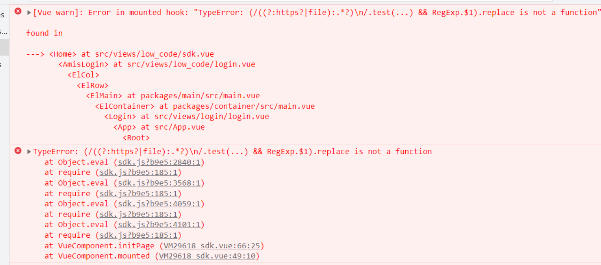

# 低代码平台调研报告

[TOC]

## 低代码框架

### amis

amis是一个由百度开源的前端低代码框架，基于 React 的组件化开发模式，通过 JSON 配置文件和 JSX 语法描述页面结构和数据模型，提供了丰富的扩展机制和插件，可以快速构建复杂的业务应用程序。

#### 优势：

1. **JSON 配置/可视化编辑生成页面：**amis 使用 JSON 配置文件来描述页面结构和数据模型；同时提供可视化编辑器，通过拖拉内置的组件，就能够快速的搭建出页面；
2. **灵活的数据配置功能**：

3. **丰富的组件库：**amis 自带了一套组件库，内置了一百多种常见的组件：包括容器组件、表单组件、列表组件、图表组件等等，能够应对大部分的 CURD 场景；

4. **完善的扩展机制：**如果 amis 自带的组件库无法满足业务需求，amis 还提供了完善的扩展机制，开发人员可以通过自定义组件、样式、主题等方式来扩展框架的功能和样式；

#### 挑战：

1. **学习成本**：

   强大丰富的组件系统同时意味着背后的学习成本；尽管 JSON 语法相对来说已经较好理解，并且可以结合可视化编辑器进行开发，但对于开发人员来说前期仍是额外的心智负担。

2. **自定义组件的拓展**：

   由于 amis 内置组件的风格与公司现有项目 UI 风格不同，可能需要大批量的自定义组件以适配现有设计风格，有以下几种方案：

   	1. 使用 js sdk 开发
   	1. 使用官方自定义组件脚手架[amis-widget-cli](https://github.com/aisuda/amis-widget-cli) ；官方同时提供了 vue 版本：[vue2-amis-custom-widget](https://github.com/aisuda/vue2-amis-custom-widget)，但目前看来使用人数较少，
   	1. 参照 [issues](https://github.com/baidu/amis/issues/31)；

3. **项目兼容性：**

​		**在 vue/uniapp 项目中使用 amis**：

​		方案1：使用官方提供的 js sdk 方式

​		方案2：将 Vue 组件转换成 React 组件；

​		方案3：

​			需要明确的是无论是从编译器、渲染器的实现原理，又或是组件生命周期通讯方式等一系列生态来看， Vue 和 React 二者都有很大的不同，因此无论选择		哪种方案都可能会存在一些兼容性问题，需要谨慎使用和调试。

​		**在小程序中使用 amis**：目前仅有的解决方案是通过 H5（WebView）的方式嵌入小程序；


#### demo展示

#### 接入方式：

1. 底层封装借助 ReactDOM 直接渲染，相关代码：

```vue
<template lang="pug">
  div(ref="renderBox")
</template>

<script>
import 'amis/lib/themes/default.css'
import { alert, confirm, render as renderSchema, toast } from 'amis'
import * as ReactDOM from 'react-dom/client'
export default {
  name: 'Amis',
  props: {
    schema: {
      type: Object,
      required: false,
      default: function () {
        return {}
      }
    },
    onAction: {
      type: Function,
      required: false,
      default: () => {}
    }
  },
  data () {
    return {
      theme: 'default'
      // theme: element
    }
  },
  watch: {
    schema: function (newSchema, oldSchema) {
      this.initPage(newSchema)
    }
  },
  mounted () {
    this.initPage(this.schema)
  },
  methods: {
    initPage (schema) {
      const root = ReactDOM.createRoot(this.$refs.renderBox)
      const element = renderSchema(
        // 页面配置
        schema,
        //
        {
          onAction: this.onAction || this.handleAction,
          theme: this.theme
        },
        // 环境变量，可以理解为这个渲染器工具的配置项
        this.env
      )
      root.render(element)
    },
    handleAction (e, action) {
      this.env.alert(`没有识别的动作：${JSON.stringify(action)}`)
    }
  }
}
</script>

```

存在问题：编译速度很慢；热更新失效。

2. sdk 方式引入：

   通过 `npm i amis` 下载包后直接在 main.js 文件中引入会报错：

   

   猜测原因可能在于 webpack 打包，参见 [issues](https://github.com/baidu/amis/issues/2709)，下面是相关代码：

   ```javascript
   // main.js
   
   import 'amis/sdk/sdk.js'
   import 'amis/sdk/sdk.css'
   import 'amis/sdk/helper.css'
   import 'amis/sdk/iconfont.css'
   ```

   ```vue
   // sdk.vue
   <template>
     <div class="home">
       <div ref="renderBox" />
     </div>
   </template>
   
   <script>
   export default {
     name: 'Home',
     props: {
       schema: {
         type: Object,
         required: false,
         default: function () {
           return {}
         }
       },
       onAction: {
         type: Function,
         required: false,
         default: () => {}
       }
     },
     watch: {
       schema: function (newSchema, oldSchema) {
         this.initPage(newSchema)
       }
     },
     mounted () {
       this.initPage({})
     },
     methods: {
       // 渲染函数
       initPage (jsonSchema) {
         const amis = window.amisRequire('amis/embed')
         // console.log(amis, this.$refs.renderWrap, amisJSON)
         amis.embed(this.$refs.renderBox, jsonSchema)
       }
     }
   }
   </script>
   ```

   解决方案：将 sdk 文件下载后放在 public 文件夹下，通过 index.html script 引入；

3.  vuera 转换

需求场景1：

需求场景2：


## 低代码表单

接下来介绍的几款产品概念有别于低代码平台（框架），其定位是**低代码表单**，侧重点在**快速构建数据收集和处理的表单页面**：

### ~~[Formil](https://formilyjs.org/zh-CN)~~

~~Formily 是阿里提供的低代码表单开源平台；~~

~~相较于 amis ，Formily  在功能上逊色许多，但是在架构层面上，aims 底层与 UI 框架（React）高度耦合，在 vue 项目中只能通过 SDK 或其它降级方案使用；~~

~~而 Formily 将内核层单独拆分，在其基础上进行 UI 层面桥接以及组件库的拓展，官网提供了 [@formily/vue](https://vue.formilyjs.org/) UI 库及 [@formily/element](https://element.formilyjs.org/) 组件系统，针对公司大部分项目能够直接接入使用，无需做额外的组件转换及UI处理。~~


### [Variant Form](https://vform666.com/)

github：

免费版本体验地址：[VForm](http://120.92.142.115/)

付费版本体验地址：[VForm Pro](http://120.92.142.115/pro/)

### [FormMaking](https://form.making.link/#/zh-CN/)

github：

免费版本体验地址：

付费版本体验地址：


#### 优势：

1. **JSON 配置/可视化编辑生成页面：**amis 使用 JSON 配置文件来描述页面结构和数据模型；同时提供可视化编辑器

2. **丰富的组件库：**amis 自带了一套组件库，内置了一百多种常见的组件：包括容器组件、表单组件、列表组件、图表组件等等，能够应对大部分的 CURD 场景。

3. **扩展机制：**amis 提供了完善的扩展机制，如果 amis 自带的组件库无法满足业务需求，开发人员可以通过自定义组件（需要掌握 React ）、样式、主题等方式来扩展框架的功能和样式。

相较于 amis ，Variant Form 和 FormMaking 这两款产品在提供的功能上逊色许多，但是其本身是基于 vue + element 开发，因此针对 vue/ uniapp 项目无需做额外的组件转换及UI处理就能接入，对公司项目的兼容更加友好；

#### 小程序可以使用VForm吗？

可以用H5（WebView）的方式嵌入小程序。

#### Uniapp可以使用VForm吗？

VForm是一个Vue组件，可以像其他Vue组件一样在Uniapp中使用，可打包输出Web/H5（不支持打包输出小程序）。

## 总结

通用问题：

1. 生态不够完善
2. 

图例说明：

> :heavy_check_mark:	原生支持  
>
> :o:	原生不支持，但是有降级方案  
>
> :heavy_multiplication_x:	不支持

|                                                           | amis                     | Formily            | Variant Form       |      |
| --------------------------------------------------------- | ------------------------ | ------------------ | ------------------ | ---- |
| 支持看板（可视化编辑器）                                  | :heavy_check_mark:       |                    |                    |      |
| 支持配置转换 JSON（可视化编辑器配置出来的代码转换成json） | :heavy_check_mark:       |                    |                    |      |
| 支持 JSON 渲染成代码                                      | :heavy_check_mark:       | :heavy_check_mark: |                    |      |
| 支持 vue 技术栈                                           | :o:                      |                    | :heavy_check_mark: |      |
| 支持小程序                                                | :o:                      |                    | :o:                |      |
| 支持 uniapp                                               |                          |                    | :heavy_check_mark: |      |
| 支持接口字段绑定到页面                                    | :heavy_check_mark:       |                    |                    |      |
| 支持代码块（前端代码块）嵌入（如：事件点击回调的拓展）    | :heavy_check_mark:       |                    |                    |      |
| 支持二次开发                                              | :heavy_check_mark:       |                    |                    |      |
| 支持低代码发布打包成小程序（uniapp）                      | :heavy_multiplication_x: |                    |                    |      |

兼容性：

|          | amis |      |      |      |
| -------- | ---- | ---- | ---- | ---- |
| vue 项目 | ✔️    |      |      |      |
| 小程序   | ✔️    |      |      |      |
| uniapp   | ✔️    |      |      |      |

适用场景：amis > 

灵活性：amis > 

维护成本：amis > formMaking 

学习成本：amis > formMaking >

