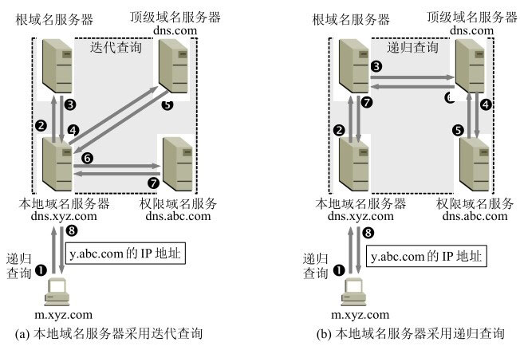
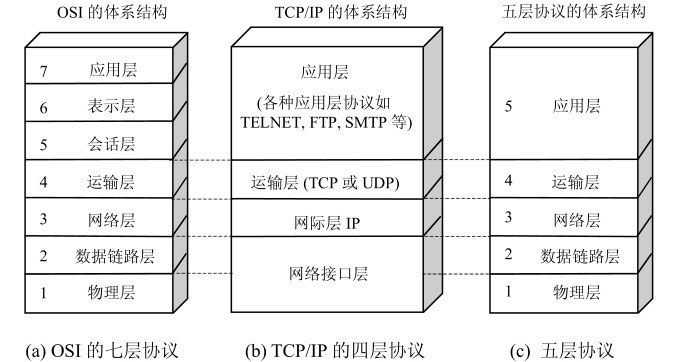

[toc]

从输入URL到页面渲染完成，会经过哪些环节？

# 浏览器开启网络请求线程

    浏览器是多进程的，其中的内核进程下有负责网络请求的线程。当输入URL后，浏览器会进行解析，然后开辟一个网络线程去请求资源。

# DNS查询

    如果我们输入的是一个域名，那么首先会检查**浏览器的DNS缓存**；

    如果没有找到，再去找**本地的 hosts 文件** 和 **本地 DNS 解析器缓存** 是否有域名到IP的映射；

    如果还是没有，那么 DNS 会使用**UDP** 数据报，先向本地DNS服务器发起请求，如果 本地DNS服务器 没有，会向 **根DNS服务器** 发起请求，然后采用 **递归** 或 **迭代** 的方式，通过 **根DNS服务器**、**顶级DNS服务器**、**权限DNS服务器**，一直到得到域名的IP地址。

# 生成 HTTP

    URL解析完成之后，会根据规定来生成 HTTP 请求报文。

    HTTP 请求报文，由**通用头部**、 **请求头部（可选）** 以及 **请求实体** 组成。

    **通用头部**：一般会有这些信息——请求的 URL 、请求的方法、请求返回的状态码、请求的服务器IP。

# TCP 三次握手

    拿到了IP地址后，就需要建立 TCP 连接；这里建立 TCP 连接会有一个三次握手的过程；

    首先客户端会发起请求连接报文，将首部 SYN 置为 1，消耗掉一个序号 seq 为 x ，服务端收到后会回复一个确认报文，将报文首部 SYN 置为 1，ACK 置为 1，确认号为 x + 1，同时自身也要消耗掉一个序号 seq 为 y；客户端在收到确认报文后，需要再次给出确认，将报文首部 ACK 置为 1，确认号为 y + 1。

# 五层因特网协议栈

1. 应用层：**定义引用进程间的交互规则**；比如：万维网 **HTTP协议**、电子邮件的 **SMTP协议**、文件传输 **FTP协议**。
2. 运输层：为两个主机的进程之间提供通用的数据传输服务，具有复用和分用的特性；**复用**：多个应用层进程，可以**同时使用运输层服务**；**分用**：运输层能够把收到的信息，**分别交付给应用层对应进程**；主要协议有： **TCP协议** 和 **UDP协议**。
3. 网络层：负责为主机之间**提供通信服务**，把运输层报文封装成**包**，并选择合适的路由传输；使用的主要是 **IP协议** 和 各种 **路由选择协议**。
4. 数据链路层：将网络层交付的 **IP数据报** 组装成 **帧**；所谓的帧就是一段有限的0/1序列。帧中包含起始地址、结束地址和数据，还能探测错误的校验序列。帧就像一个信封将数据包裹起来。
5. 物理层：光纤、电缆或者电磁波等真实存在的物理媒介。

# 服务端返回

    如果请求成功，并且设置了缓存机制，那么在目标文件未修改的情况下，服务端会返回一个**状态码 304**，告诉客户端文件未改变，**可以直接使用本地缓存**；或者是返回对应的资源文件给到客户端。

# 浏览器解析页面

    浏览器接收到资源文件，开始解析——

1. 首先，解析html生成DOM；
2. 解析CSS生成CSSOM（CSS 对象模型）；
3. 将DOM 和 CSSOM 结合，生成一棵 render 渲染树；
4. 根据 render 树，生成布局，比如计算元素尺寸、位置等；
5. 最后再将 render 树绘制到页面上。

# 浏览器解析JS脚本

- 进行词法分析，生成词法单元，转换成 AST，最后将 AST 转换成机器指令
- 进入执行阶段，会创建对应的执行上下文，确定 this 指向，创建词法环境、变量环境；将对应的代码推入执行栈，这里还有个 js 的事件循环的过程；
- 如果函数执行完毕，就会进行垃圾回收，常用的有：标记清除 和 引用计数两种，目前主流采用的是标记清除的方法

# TCP 四次挥手

    最后如果 TCP 连接使用完毕，会经过四次挥手，将 TCP 连接释放；

1. 客户端和服务端都处在 **ESTABLISHED**（已建立链接）状态，客户端首先会向服务端发送 **连接释放报文**，把首部 **FIN 置为 1**，把序号 **seq 置为 u**，即发送的最后一个字节的序号加 1；然后客户端进入 **FIN-WAIT-1**（终止等待1）状态；
2. 服务端收到连接释放报文后，向客户端发起确认，把首部 **ACK 置为 1**，**确认号为 u + 1**，即客户端发送的序号加1，同时如果要发送数据，则消耗掉一个序号 **seq 置为 v**；然后，服务端会进入 **CLOSE-WAIT**（关闭等待）状态。
3. 此时，TCP 连接处于 **半关闭**（half-close）状态，也就是说客户端已经没有数据需要往服务端发送了，但是服务端仍然可以往客户端发送数据。
4. 客户端在收到服务端的确认报文后，会进入 **FIN-WAIT-2**（终止等待2）状态，等待服务端发起连接释放报文段；
5. 服务端数据传输完毕后，会把报文段首部 **FIN 置为 1**， **确认号为 u + 1**，即上次发送过的确认号；把序号 **seq 置为 w**（因为服务端可能又往客户端发送了数据，消耗了序号）；此时，服务端进入 **LAST-ACK**（最后确认）状态，等待客户端的确认；
6. 客户端收到连接释放报文后，会发送确认报文，在确认报文中，把 **ACK 置为 1**，**确认号为 w + 1**，**序号为  u + 1**， 即发送 FIN 报文时的序号 + 1，然后客户端进入 **TIME-WAIT**（时间等待）状态；
7. 此时连接还没有完全释放，需要等待 **2 MSL（Maximum Segment Lifetime 最长报文段寿命** 后，再完全释放连接。
