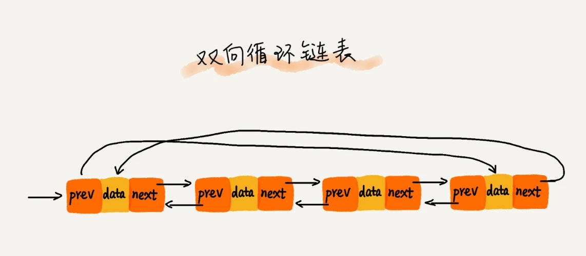

# 链表
链表通过指针，将一组 **零散的内存块** 串联起来。

## 单链表
只有一个方向，结点只有一个后继指针 next 指向后面的结点，尾指针指向 null。

## 循环链表
只有一个方向，结点只有一个后继指针 next 指向后面的结点，尾指针指向头结点。

## 双向链表
每个节点有一个后继指针 next 指向后面的节点，同时还有一个前驱指针 prev 指向前面的节点。

## 双向循环链表

## 链表的删除
* 删除节点中，值等于某个给定值，的节点：  
这种情况需要从头节点开始一个个遍历，进行对比，直到找到给定值再进行删除，**时间复杂度是O（n）**

* 删除给定指针指向的节点：  
这种情况下，我们已经知道了需要删除的节点，假设为 a；此时需要断开 a 这个节点与它的后继节点以及前驱节点的关系。  
对于单链表而言，我们不知道 a 的前驱节点是什么，只能遍历，直到 b.next = a，说明 b 是 a 的前驱节点，**时间复杂度是O（n）**；  
而对于双链表，可以直接用 a.prev 来获取前驱节点，**时间复杂度是O（1）**

## 链表的插入
单链表时间复杂度是O(n);  
双链表时间复杂度是O(1); 

## LRU 缓存策略
1. 维护一个有序单链表；
2. 越靠近链表尾部的节点是越早被访问过的；
3. 当访问某个数据 x 时，从链表的表头开始遍历链表；
   * 如果 x 之前已经被缓存了，那么将 x 从原来的位置删除（断开 next、prev），然后插入链表头部；
    * 如果 x 不在缓存链表中：
      * 内存未满，将 x 直接插入链表头部；
      * 内存已满，将链表尾部节点删除，再将 x 插入链表头部。

## 链表边界条件
* 如果链表为空时，代码是否能正常工作？
* 如果链表只包含一个结点时，代码是否能正常工作？
* 如果链表只包含两个结点时，代码是否能正常工作？
* 代码逻辑在处理头结点和尾结点的时候，是否能正常工作？